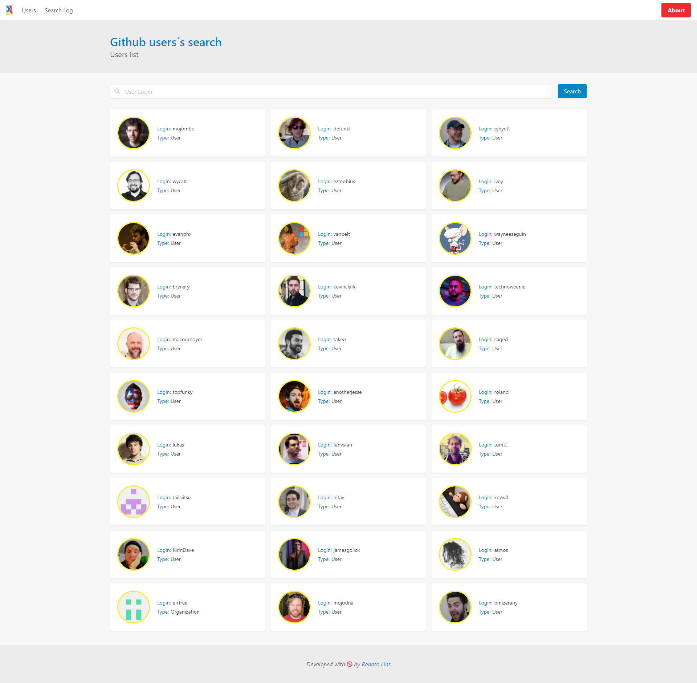
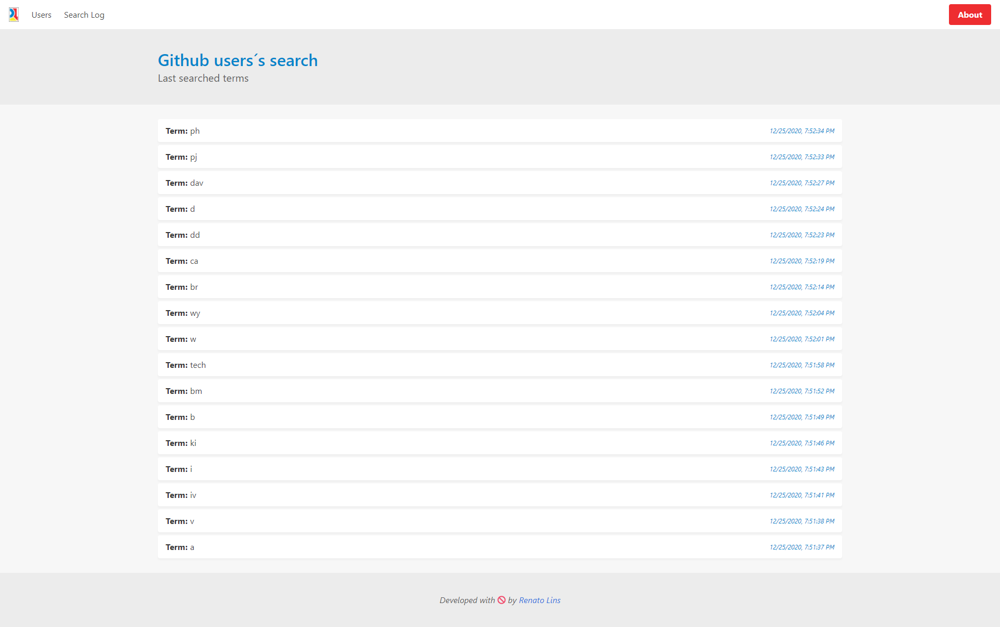

# Vanilla Javascript SPA

This project is about adding to my portfolio a Single Page Application(SPA) built with Vanilla Javascript. You can see it in action [here](https://vanilla-js-spa.doolien.repl.co](https://vanilla-js-spa-git-master-renatolinsdigital.vercel.app).

# Screenshots

## Home

## Search term log

## Running The project

Considering this project uses ES6 modules - that are subject to Same-origin policy - messing with files requires a local server like  __live-server__(for instance), which can be easily installed on VS Code.

## Key features:

- The app is fully responsive
- A modularized yet minimalist code base achieved with ES6+ modules and template strings
- Search log history can be used to trigger the same searches again
- Search log history is precisely dated, showing always the last searches
- Search log is saved to local storage
- Searching terms also works in the URL
- Routing between pages keeps navigation history 

## Project´s intentional restrictions:

- No Javascript frameworks
- No DOM/UI libraries such as jQuery or Zepto
- No bundlers like gulp or webpack
- No Javascript or CSS processors/transpilers of any nature
- No package managers like npm or yarn

## What was allowed:

- A CSS framework with a design system approach, since it doesn´t break project´s restrictions
- Running a local host server(as ES6+ modules require one)
- A routing library(also in Vanilla JS) for helping on SPA behaviors

